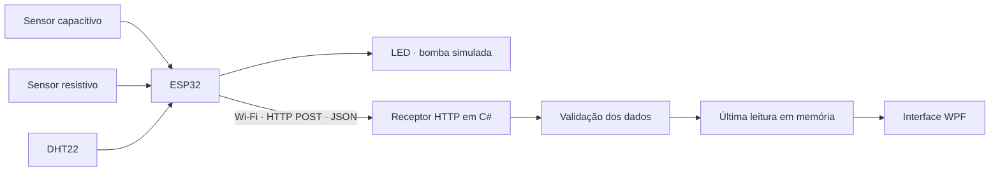

<div align="center">

# 🌱 AppEmbarcado

### Monitoramento de solo com ESP32 e C#

Um projeto acadêmico de Sistemas Embarcados para acompanhar sensores de solo, visualizar condições ambientais e simular o acionamento de uma bomba de irrigação.

**ESP32 · C# · .NET 8 · WPF · HTTP / Wi-Fi**

🚧 **Em desenvolvimento — estrutura de classes e receptor HTTP implementados**

[Sobre](#sobre-o-projeto) · [Arquitetura](#arquitetura) · [Como começar](#como-começar) · [API](#comunicação-http) · [Próximos passos](#próximos-passos)

</div>

---

## Sobre o projeto

O AppEmbarcado propõe substituir o display LCD de um experimento de monitoramento de solo por uma aplicação desktop em C#. O ESP32 fará a aquisição das leituras e enviará os dados por HTTP, usando a rede Wi-Fi local.

A proposta reúne dois sensores de solo — capacitivo e resistivo —, um DHT22 para temperatura e umidade do ar e um LED para representar uma bomba de água ligada. A interface WPF será responsável pela visualização dos dados.

O trabalho também prevê a definição experimental de referências de **capacidade de campo** e **ponto de murcha**, com parâmetros separados para cada sensor.

> **Estado atual:** as classes C# e as rotas HTTP estão implementadas. O projeto ainda compila como biblioteca, sem janela ou executável. A integração HTTP com o ESP32, o DHT22 e o LED ainda será realizada.

## Componentes do experimento

| Componente | Função | Situação |
| :--- | :--- | :--- |
| ESP32 | Ler sensores e transmitir dados por Wi-Fi | Leitura dos sensores de solo realizada; envio HTTP pendente |
| Sensor capacitivo · GPIO 35 | Fornecer leitura bruta do solo | Leituras observadas no Monitor Serial |
| Sensor resistivo · GPIO 32 | Fornecer uma segunda leitura do solo | Leituras observadas no Monitor Serial |
| DHT22 | Medir temperatura e umidade do ar | Integração pendente; GPIO a definir |
| LED | Simular o estado da bomba de água | Integração pendente; GPIO a definir |
| Aplicação C# / WPF | Receber e apresentar os dados | Classes prontas; interface pendente |

## Arquitetura

Fluxo previsto para o sistema completo:



O computador registra o horário de recebimento em UTC. A última mensagem fica disponível no repositório em memória e pela API. A futura janela poderá consultar esse repositório para atualizar a visualização.

## O que já está implementado

- Contrato de dados para os dois sensores de solo, DHT22 e estado da bomba.
- Campos opcionais para permitir a integração gradual do hardware.
- Validação das mensagens recebidas.
- Armazenamento da última leitura, com acesso sincronizado.
- Receptor HTTP com rotas de status, recebimento e consulta.
- Modelos para as referências experimentais de cada sensor.

Os dados permanecem somente em memória e são perdidos ao encerrar a aplicação. Ainda não há histórico, banco de dados, cálculo de umidade do solo em porcentagem ou controle automático de irrigação.

## Organização do código

```text
AppEmbarcado/
├── AppEmbarcado.sln
├── README.md
└── AppEmbarcado/
    ├── AppEmbarcado.csproj
    ├── Models/
    │   ├── LeituraSensores.cs
    │   ├── LeituraRecebida.cs
    │   └── ParametrosSolo.cs
    └── Services/
        ├── ValidadorLeitura.cs
        ├── RepositorioLeituras.cs
        └── ServidorHttp.cs
```

| Classe | Responsabilidade |
| :--- | :--- |
| `LeituraSensores` | Representar a mensagem enviada pelo ESP32 |
| `LeituraRecebida` | Associar a mensagem ao horário de recebimento |
| `ReferenciasSoloAdc` | Guardar referências de capacidade de campo e ponto de murcha em ADC |
| `ParametrosSolo` | Separar as referências do sensor capacitivo e do resistivo |
| `ValidadorLeitura` | Verificar os campos antes do armazenamento |
| `RepositorioLeituras` | Registrar e consultar a última mensagem recebida |
| `ServidorHttp` | Disponibilizar as rotas e gerenciar o ciclo de vida do receptor |

## Como começar

### 1. Preparar o ambiente

- Windows, pois o projeto está configurado para WPF.
- SDK do .NET 8 ou um SDK compatível com o destino `net8.0-windows`.
- Visual Studio com suporte a desenvolvimento desktop .NET, caso utilize essa IDE.

### 2. Clonar e compilar

```powershell
git clone https://github.com/HugoPereiraP/AppEmbarcado.git
cd AppEmbarcado
dotnet restore AppEmbarcado.sln
dotnet build AppEmbarcado.sln
```

A compilação gera a biblioteca `AppEmbarcado.dll`. **Nesta etapa, não há aplicação para abrir com `dotnet run`.**

### 3. Integrar o receptor à futura aplicação

A janela WPF deverá manter uma instância do repositório e do servidor durante sua execução. Exemplo do ciclo de vida:

```csharp
using AppEmbarcado.Services;

var repositorio = new RepositorioLeituras();
await using var servidor = new ServidorHttp(repositorio);

await servidor.IniciarAsync();

// A aplicação permanece aberta e consulta repositorio.ObterUltima().
// Na implementação WPF, encerrar o servidor somente ao fechar a aplicação.

await servidor.PararAsync();
```

Esse trecho é uma referência de integração, não um programa completo. A interface poderá consultar os dados com um `DispatcherTimer`, mantendo as atualizações visuais na thread da janela.

## Comunicação HTTP

O receptor utiliza a porta **5000** por padrão e escuta nas interfaces de rede do computador. A porta pode ser alterada no construtor de `ServidorHttp`.

O endereço de destino no ESP32 terá este formato:

```text
http://IP_DO_COMPUTADOR:5000/api/leituras
```

Os dispositivos precisam conseguir se comunicar na rede local, com a porta permitida no firewall. No ESP32, use o IP do computador: `localhost` apontaria para o próprio dispositivo. O receptor atual não possui autenticação e está destinado à rede local do experimento.

### Rotas disponíveis

| Método | Rota | Resultado |
| :--- | :--- | :--- |
| `GET` | `/api/status` | `200` com o status `online` |
| `POST` | `/api/leituras` | `200` com a leitura registrada; `400` para dados inválidos |
| `GET` | `/api/leituras/ultima` | `200` com a última leitura; `204` se nenhuma foi recebida |

### Exemplo com os sensores de solo

Enviar com o cabeçalho `Content-Type: application/json`:

```json
{
  "dispositivoId": "esp32-01",
  "capacitivoAdc": 546,
  "resistivoAdc": 2526
}
```

Esses números ilustram uma leitura observada no experimento. **Não são limites de calibração.**

### Exemplo com todos os componentes

Valores fictícios para demonstrar o contrato futuro:

```json
{
  "dispositivoId": "esp32-01",
  "capacitivoAdc": 546,
  "resistivoAdc": 2526,
  "temperaturaC": 27.4,
  "umidadeArPercentual": 64.2,
  "bombaLigada": false
}
```

| Campo | Tipo | Regra |
| :--- | :--- | :--- |
| `dispositivoId` | Texto | Obrigatório e não vazio |
| `capacitivoAdc` | Inteiro ou `null` | Valor bruto não negativo |
| `resistivoAdc` | Inteiro ou `null` | Valor bruto não negativo |
| `temperaturaC` | Número ou `null` | Temperatura finita em °C |
| `umidadeArPercentual` | Número ou `null` | Umidade do ar entre 0 e 100 |
| `bombaLigada` | Booleano ou `null` | `true`: ligada; `false`: desligada |

Além do identificador, a mensagem deve conter pelo menos uma leitura ou o estado da bomba. Campos omitidos ou `null` representam **dado indisponível**; zero e `false` são valores válidos.

Cada mensagem substitui a anterior por inteiro. Portanto, o ESP32 deverá enviar todos os dados disponíveis em cada transmissão.

### Teste manual após iniciar o receptor

Com o servidor hospedado e iniciado por uma aplicação, execute no PowerShell do mesmo computador:

```powershell
$leitura = @{
    dispositivoId = "esp32-01"
    capacitivoAdc = 546
    resistivoAdc = 2526
} | ConvertTo-Json

Invoke-RestMethod -Uri "http://localhost:5000/api/leituras" `
    -Method Post -ContentType "application/json" -Body $leitura

Invoke-RestMethod -Uri "http://localhost:5000/api/leituras/ultima"
```

## Calibração do solo

As referências de capacidade de campo e ponto de murcha **ainda serão delimitadas no trabalho**. Os modelos mantêm esses campos sem valores até a realização do procedimento experimental.

- Cada sensor possui suas próprias referências.
- As leituras atuais são valores brutos do conversor analógico-digital (ADC).
- O código não converte ADC em porcentagem de umidade do solo.
- Preencher as referências não ativa uma regra de irrigação: essa lógica será implementada posteriormente.

## Próximos passos

- [x] Estruturar os modelos de dados em C#.
- [x] Implementar validação e armazenamento da última leitura.
- [x] Implementar as rotas do receptor HTTP.
- [x] Preparar os campos para calibração independente dos sensores.
- [ ] Criar a interface WPF e integrar o ciclo de vida do servidor.
- [ ] Implementar e validar o envio HTTP no ESP32.
- [ ] Integrar as leituras do DHT22.
- [ ] Integrar o LED e informar o estado da bomba simulada.
- [ ] Definir o procedimento experimental e registrar as referências do solo.
- [ ] Adicionar histórico, gráficos e exportação de dados.
- [ ] Implementar e validar as regras de irrigação.

---

<div align="center">

Projeto acadêmico de **Sistemas Embarcados** · Desenvolvido por [Hugo Pereira](https://github.com/HugoPereiraP)

</div>
